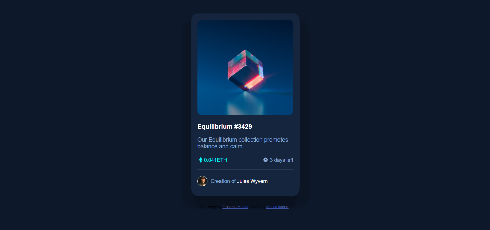
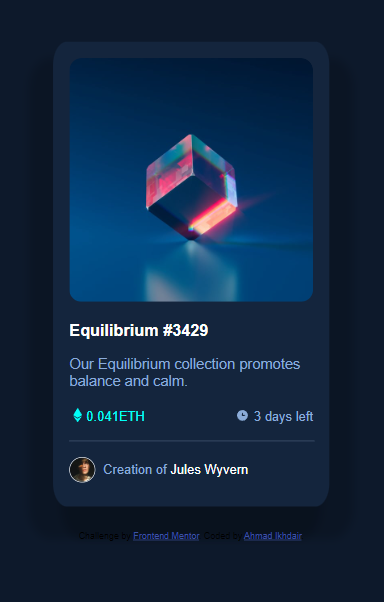

# Frontend Mentor - NFT preview card component

This is a solution to the [NFT preview card component](https://www.frontendmentor.io/challenges/nft-preview-card-component-SbdUL_w0U).

## Table of contents

- [Overview](#overview)
  - [Screenshot](#screenshot)
  - [Links](#links)
- [My process](#my-process)
  - [Built with](#built-with)
- [Author](#author)

## Overview

### Screenshot

### Links

- Solution URL:  [Soltution](https://www.frontendmentor.io/solutions/nft-preview-card-component-qM4RgSA44I)
- Live Site URL:  [Live site](https://ahmadikhdair.github.io/NFT-preview-card-component/)

## My process

### Built with

- Semantic HTML5 markup
- CSS
- Flexbox

## Author

- LinkedIn -  [Ahmad Ikhdair](https://www.linkedin.com/in/ahmad-ikhdair/)
- Frontend Mentor -  [Ahmad Ikhdair](https://www.frontendmentor.io/profile/AhmadIkhdair)
